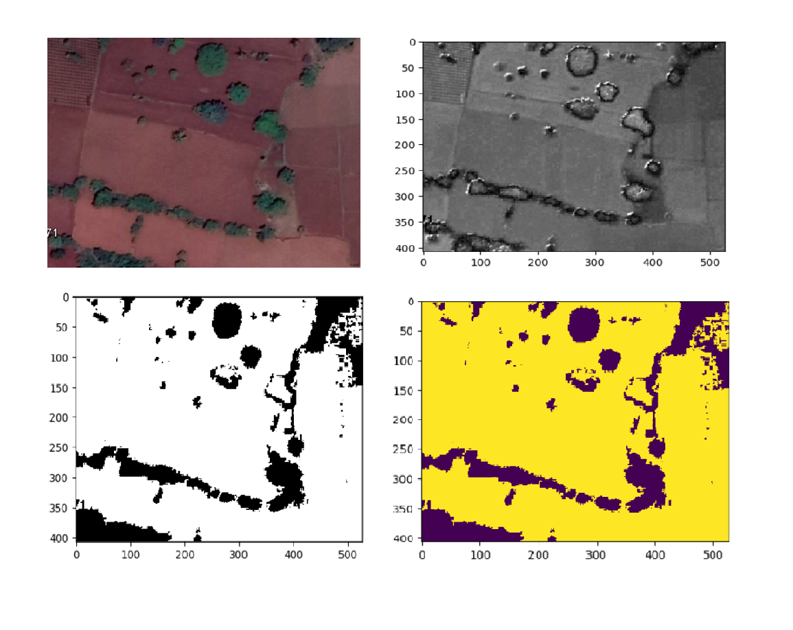

# Tree_segmentation_CV
Segmentation of trees from Arial images using CV concept.

## Getting Started

This is the repo which has a jupyter notebook where you can experiment the segmentation of tree,hills or any other obstacles for remote sensing study on areas like agriculture fields etc.. you can set the thresholding values according to your object of interest to segment from the images. helpfull when trees are coming inbetween your area of atudy so that you can segment them and remove my creating a holes.

i edited this for trial

### Packages required

* [Opencv](https://opencv.org/)
* [Plantcv](https://plantcv.readthedocs.io/en/stable/)

## usage
Run jupyter notebook "tree_segment" by editing the <path> for the image in input cell.

## sample output

## Authors

* **Mallikarjun Sajjan**  - [mullermuttu](https://github.com/millermuttu)

